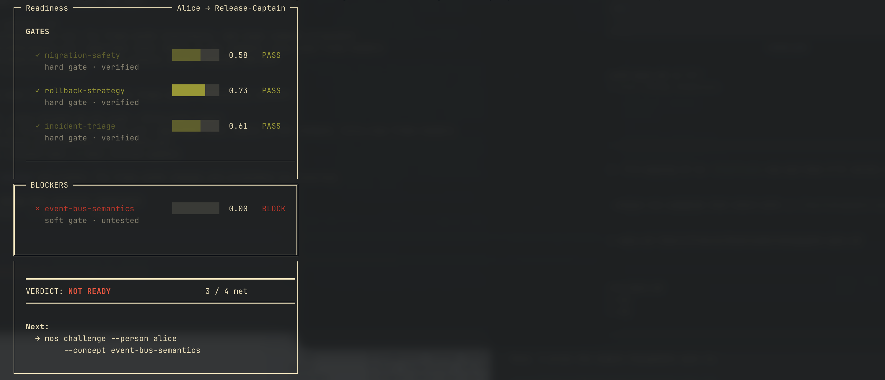

# MaintainerOS

A CLI tool for engineering teams that answers "who actually understands this codebase?" with evidence.

MaintainerOS models demonstrated understanding, inferred understanding, decay, and contestation across a codebase's concept graph. It exposes this through terminal workflows: trust maps, readiness checks, reviewer recommendations, and full evidence chains.

Built on the [Lorraine engine](../../engine/).

## Install

```bash
cd apps/maintainer-os/cli
npm install
```

## Quick start

```bash
# Initialize a workspace
mos init --repo acme/payments --db ~/.maintaineros/mos.db

# Load a domain graph (concepts, edges, file mappings, role bundles)
mos domain load --file ./domains/payments-core.json

# Ingest verification events from a JSON file
mos ingest run --source file --file ./events/february.json

# See what alice actually knows
mos status --person alice

# Can she be release captain?
mos ready --person alice --bundle release-captain

# Why does the model think she knows rollback-strategy?
mos why --person alice --concept rollback-strategy

# Who should review auth-boundaries and cache-coherency?
mos reviewers --concepts auth-boundaries,cache-coherency --top 3

# How well-calibrated is the model for alice?
mos calibrate --person alice
```

## What it does

**`mos status`** shows a trust map grouped by level (verified, inferred, contested, untested) with confidence bars, decay times, and modalities tested.

**`mos ready`** evaluates a person against a capability bundle (like `release-captain`) and returns PASS/BLOCK per concept with hard/soft gate labels.



**`mos reviewers`** ranks people by verified and inferred trust across a set of concepts. Useful for PR reviewer assignment.

**`mos why`** prints the full evidence chain for a trust decision: verification events, timestamps, modalities, inference edges, and calibration gaps.

**`mos calibrate`** shows model accuracy metrics: prediction accuracy, over/underconfidence bias, stale percentage, surprise rate, and claim calibration.

**`mos retract`** removes a verification event with an audit trail.

Every command supports `--format json` for scripting.

## Concepts

MaintainerOS organizes codebase knowledge into a graph of concepts like `auth-boundaries`, `migration-safety`, `rollback-strategy`. These connect via prerequisite and related-to edges with inference strengths.

**Domain packs** define the concept graph, file-to-concept mappings, and capability bundles for a repository.

**Capability bundles** group concepts into roles (`release-captain`, `primary-oncall`) with minimum trust level requirements per concept.

**Evidence** comes from real engineering work: PR merges, code reviews, incident response, postmortems, and structured verification probes. The system never inflates trust. Silence is not proof.

## How trust works

Trust state is derived from events, never stored directly. The engine records verification events, propagates trust through the concept graph, applies time decay, and detects contestation when modalities disagree.

Four trust levels:
- **Verified**: direct evidence from at least one modality
- **Inferred**: propagated from a verified prerequisite concept, discounted by edge strength
- **Contested**: conflicting evidence across modalities
- **Untested**: no evidence recorded

Confidence decays over time. A verification from 3 days ago carries more weight than one from 3 months ago.

## Project structure

```
apps/maintainer-os/
  cli/
    src/
      commands/       # CLI command handlers
      lib/            # Formatters, config, store, scoring, explanation
    tests/            # Unit, integration, and E2E tests
    fixtures/         # Example domain pack and event files
  docs/
    specs/            # CLI spec, product spec
    tasks/            # Numbered implementation tasks
```

## Testing

```bash
cd apps/maintainer-os/cli
npx vitest run
```

60 tests across 11 test files, including a full end-to-end test that runs the complete local pilot loop: init, domain load, ingest, status, ready, why, calibrate, reviewers.

## Exit codes

| Code | Meaning |
|------|---------|
| 0 | Success |
| 2 | Policy/readiness unmet (not an error, just a "no") |
| 3 | Configuration error |
| 4 | Upstream ingest error |
| 5 | Storage error |

## Current status

Phase 1 (local pilot) is complete. Phase 2 (GitHub ingest, concept-to-file mapping, scheduled decay) is next.
